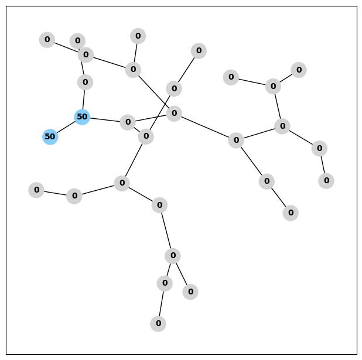

# NodeInvasion

A simple environment for Reinforcement Learning. Try to solve it.

&nbsp;

## Rule:
1. Within limited _timestep_, player(agent) should try to __occupy__ all nodes in __graph__. Makes all nodes full __energy__ gives largest score(reward).

    The node graph looks like:

    

    Where __occupied__ nodes are lightskyblue, not occupied nodes are lightgray in color. Current energy of each nodes are shown as label of nodes.

&nbsp;

2. The behaviour of a node share its _energy_ to another node is called __diffusion__. A success __diffusion__ should satisfy conditions below:
    - The selected node should be __occupied__, and its _energy_ should __greater than__ 50.
    - The target node is __not occupied__, and it is an __edge__ of the __selected node__.(edge means they are connected directly)

&nbsp;

3. In each timestep, player(agent) should select a __selected node__ and __target node__ by their indices in the node graph. For example, __node S__ and __node 3__ are edges of each other, and their indices are __0__ and __3__ respectively, player should specify [0, 3] as _action_.

&nbsp;

4. _action_ in this environment is the indices of __selected node__ and __target node__ as a _numpy array_ or _tuple_.

&nbsp;

Have fun!
